# Droid FineTuning - Complete Architecture Flowchart

```mermaid
graph TB
    %% Styling
    classDef electron fill:#61dafb,stroke:#333,stroke-width:3px,color:#000
    classDef frontend fill:#646cff,stroke:#333,stroke-width:2px,color:#fff
    classDef backend fill:#ff6b6b,stroke:#333,stroke-width:2px,color:#fff
    classDef mlx fill:#4ecdc4,stroke:#333,stroke-width:2px,color:#000
    classDef data fill:#ffe66d,stroke:#333,stroke-width:2px,color:#000
    classDef external fill:#95e1d3,stroke:#333,stroke-width:2px,color:#000

    %% Top Level - Electron App
    START([User Launches App]):::electron
    ELECTRON[Electron Main Process<br/>src/main.ts]:::electron

    START --> ELECTRON

    %% Electron spawns backend and creates window
    ELECTRON --> SPAWN_BACKEND[Spawn Backend Server<br/>Python uvicorn]:::electron
    ELECTRON --> CREATE_WINDOW[Create BrowserWindow<br/>1400x900]:::electron

    %% Backend Server
    SPAWN_BACKEND --> BACKEND[FastAPI Backend Server<br/>backend/main.py<br/>Port 8000]:::backend

    %% Frontend Window
    CREATE_WINDOW --> FRONTEND[React Frontend<br/>frontend/dist/index.html]:::frontend

    %% Frontend Pages
    FRONTEND --> ROUTER{React Router<br/>HashRouter}:::frontend

    ROUTER --> PAGE_SETUP[Setup Page<br/>Standard SFT Training]:::frontend
    ROUTER --> PAGE_ENHANCED[Enhanced Setup Page<br/>GRPO/GSPO/Dr.GRPO]:::frontend
    ROUTER --> PAGE_TRAINING[Training Page<br/>Real-time Monitoring]:::frontend
    ROUTER --> PAGE_RESULTS[Results Page<br/>Training History]:::frontend
    ROUTER --> PAGE_COMPARE[Compare Page<br/>Base vs Fine-tuned]:::frontend
    ROUTER --> PAGE_FUSION[Fusion Page<br/>Adapter Fusion]:::frontend

    %% WebSocket Connection
    FRONTEND -.WebSocket.-> WS[WebSocket /ws<br/>Real-time Updates]:::backend
    WS -.Training Metrics.-> PAGE_TRAINING

    %% Backend API Endpoints
    BACKEND --> API_HEALTH[GET /health]:::backend
    BACKEND --> API_MODELS[GET /models]:::backend
    BACKEND --> API_TRAINING[Training APIs]:::backend
    BACKEND --> API_SESSION[Session APIs]:::backend
    BACKEND --> API_INFERENCE[Inference APIs]:::backend
    BACKEND --> API_ENHANCED[Enhanced Training APIs]:::backend
    BACKEND --> API_FUSION[Fusion APIs]:::backend
    BACKEND --> API_EVAL[Evaluation APIs]:::backend

    %% Training API Details
    API_TRAINING --> TRAIN_STATUS[GET /training/status]:::backend
    API_TRAINING --> TRAIN_START[POST /training/start]:::backend
    API_TRAINING --> TRAIN_STOP[POST /training/stop]:::backend
    API_TRAINING --> TRAIN_LOGS[GET /training/logs]:::backend

    %% Enhanced Training
    API_ENHANCED --> ENH_METHODS[GET /api/training/methods]:::backend
    API_ENHANCED --> ENH_VALIDATE[POST /api/training/validate-data]:::backend
    API_ENHANCED --> ENH_START[POST /api/training/start-enhanced]:::backend
    API_ENHANCED --> ENH_SAMPLE[POST /api/training/generate-sample-data]:::backend

    %% Training Managers
    TRAIN_START --> FACTORY{Backend Factory<br/>backend_factory.py}:::backend
    ENH_START --> FACTORY

    FACTORY --> TRAIN_MGR[TrainingManager<br/>main.py<br/>Standard SFT]:::backend
    FACTORY --> ENH_MGR[EnhancedTrainingManager<br/>main_enhancements.py<br/>GRPO Methods]:::backend

    %% Standard Training Flow
    TRAIN_MGR --> PREPARE_DATA[Prepare Training Data<br/>Auto-tokenization]:::backend
    PREPARE_DATA --> LORA_CONFIG[Generate LoRA Config<br/>Architecture Detection]:::backend
    LORA_CONFIG --> BUILD_CMD[Build MLX-LM Command<br/>python -m mlx_lm.lora]:::mlx
    BUILD_CMD --> SPAWN_TRAIN[Spawn Training Process<br/>subprocess.Popen]:::backend
    SPAWN_TRAIN --> PARSE_LOGS[Parse Training Logs<br/>Extract Metrics]:::backend
    PARSE_LOGS --> BROADCAST[Broadcast via WebSocket<br/>to Frontend]:::backend

    %% Enhanced Training Flow
    ENH_MGR --> ENH_PREPARE[Prepare GRPO Data<br/>Validate Format]:::backend
    ENH_PREPARE --> ENH_CONFIG[Build Enhanced Config<br/>GRPO/GSPO/Dr.GRPO]:::backend
    ENH_CONFIG --> BUILD_ENH_CMD[Build MLX-LM-LORA Command<br/>python -m mlx_lm_lora.train]:::mlx
    BUILD_ENH_CMD --> SPAWN_ENH[Spawn Enhanced Process<br/>debug.debug_trainer]:::backend
    SPAWN_ENH --> PARSE_ENH[Parse RL Metrics<br/>Rewards/KL/Entropy]:::backend
    PARSE_ENH --> BROADCAST

    %% MLX Training Execution
    BUILD_CMD --> MLX_SFT[MLX-LM LoRA Training<br/>mlx_lm.lora<br/>Apple's Official]:::mlx
    BUILD_ENH_CMD --> MLX_GRPO[MLX-LM-LORA Training<br/>mlx_lm_lora.train<br/>GRPO Methods]:::mlx

    %% MLX Framework
    MLX_SFT --> MLX_CORE[MLX Core Framework<br/>Apple Silicon Optimized<br/>Metal GPU Acceleration]:::mlx
    MLX_GRPO --> MLX_CORE

    %% Training Output
    MLX_SFT --> ADAPTERS[LoRA Adapters<br/>artifacts/lora_adapters/<br/>.safetensors]:::data
    MLX_GRPO --> ADAPTERS

    ADAPTERS --> CHECKPOINT[Checkpoint Files<br/>0000XXX_adapters.safetensors]:::data
    ADAPTERS --> BEST[Best Model<br/>best_adapters.safetensors]:::data
    ADAPTERS --> CONFIG[Adapter Config<br/>adapter_config.json]:::data

    %% Session Management
    API_SESSION --> SESSION_LIST[GET /sessions]:::backend
    API_SESSION --> SESSION_GET[GET /sessions/:id]:::backend
    API_SESSION --> SESSION_LOAD[POST /sessions/:id/load]:::backend
    API_SESSION --> SESSION_DELETE[DELETE /sessions/:id]:::backend

    SESSION_LOAD --> SESSION_FILES[Session Files<br/>sessions/*.json]:::data

    %% Inference
    API_INFERENCE --> INFERENCE_BASE[POST /model/test-base<br/>Test Base Model]:::backend
    API_INFERENCE --> INFERENCE_ADAPTED[POST /model/test<br/>Test with Adapter]:::backend
    API_INFERENCE --> INFERENCE_UNIFIED[POST /models/inference<br/>Unified Endpoint]:::backend

    INFERENCE_UNIFIED --> LOAD_MODEL[Load MLX Model<br/>mlx_lm.load]:::mlx
    LOAD_MODEL --> CHAT_TEMPLATE[Apply Chat Template<br/>tokenizer.apply_chat_template]:::mlx
    CHAT_TEMPLATE --> GENERATE[Generate Tokens<br/>mlx_lm.generate_step]:::mlx
    GENERATE --> SAMPLE[Anti-repetition Sampling<br/>top_p=0.9, min_p=0.05]:::mlx

    %% Fusion
    API_FUSION --> FUSION_COMBINE[POST /api/fusion/combine<br/>Combine Adapters]:::backend
    API_FUSION --> FUSION_LAYERED[POST /api/fusion/combine-layered<br/>Layer-specific Fusion]:::backend
    API_FUSION --> FUSION_EXPORT[POST /api/fusion/export<br/>Export Fused Model]:::backend

    FUSION_COMBINE --> FUSION_SCRIPT[adapter_fusion/fusion_adapters.py<br/>Weighted Averaging]:::external
    FUSION_LAYERED --> FUSION_SCRIPT

    %% Evaluation
    API_EVAL --> EVAL_START[POST /api/evaluation/start<br/>Start Evaluation]:::backend
    API_EVAL --> EVAL_RESULTS[GET /api/evaluation/results<br/>Get Results]:::backend

    EVAL_START --> EVAL_SCRIPT[adapter_fusion/evaluate_adapters.py<br/>Benchmark Tasks]:::external

    %% Data Flow
    PAGE_SETUP -.Configure SFT.-> TRAIN_START
    PAGE_ENHANCED -.Configure GRPO.-> ENH_START
    PAGE_TRAINING -.Monitor.-> WS
    PAGE_RESULTS -.Load History.-> SESSION_LIST
    PAGE_COMPARE -.Test Models.-> INFERENCE_UNIFIED
    PAGE_FUSION -.Fuse Adapters.-> FUSION_COMBINE

    %% External Dependencies
    MLX_CORE --> METAL[Metal GPU Framework<br/>Apple Silicon]:::external

    %% Data Sources
    USER_DATA[User Training Data<br/>train.jsonl / valid.jsonl]:::data
    MODEL_DIR[Base Models Directory<br/>MLX Format Models]:::data

    USER_DATA --> PREPARE_DATA
    USER_DATA --> ENH_PREPARE
    MODEL_DIR --> LOAD_MODEL
    MODEL_DIR --> API_MODELS

    %% Logs
    PARSE_LOGS --> LOG_FILES[Log Files<br/>logs/gui_training.log<br/>logs/backend.log]:::data
    PARSE_ENH --> LOG_FILES

    %% Redux State Management
    PAGE_SETUP --> REDUX[Redux Store<br/>Training State<br/>Config State]:::frontend
    PAGE_ENHANCED --> REDUX
    PAGE_TRAINING --> REDUX
    PAGE_RESULTS --> REDUX
    PAGE_COMPARE --> REDUX
    PAGE_FUSION --> REDUX

    REDUX -.Persist.-> LOCAL_STORAGE[Browser LocalStorage]:::data
```



## Component Legend

### 🔵 Electron Layer (Light Blue)
- **Main Process** - Spawns backend, creates window, manages lifecycle
- **IPC Handlers** - File dialogs, menu actions

### 🟣 Frontend Layer (Purple)
- **React Pages** - 6 main pages for different workflows
- **Redux Store** - Global state management
- **WebSocket Hook** - Real-time updates from backend

### 🔴 Backend Layer (Red)
- **FastAPI Server** - REST API endpoints, WebSocket server
- **Training Managers** - Dual system (Standard + Enhanced)
- **API Routes** - Training, Session, Inference, Fusion, Evaluation

### 🟢 MLX Layer (Teal)
- **MLX-LM** - Apple's official LoRA training
- **MLX-LM-LORA** - Enhanced GRPO/GSPO/Dr.GRPO training
- **MLX Core** - Apple Silicon optimized ML framework
- **Metal** - GPU acceleration on Apple hardware

### 🟡 Data Layer (Yellow)
- **Training Data** - JSONL format datasets
- **Adapters** - LoRA checkpoint files
- **Sessions** - Training session persistence
- **Logs** - Training and application logs

### 🟢 External Dependencies (Mint)
- **Fusion Scripts** - Adapter combination utilities
- **Evaluation Scripts** - Benchmark testing
- **Metal Framework** - Apple GPU acceleration

## Key Data Flows

1. **Standard Training**: Setup Page → TrainingManager → MLX-LM → LoRA Adapters
2. **Enhanced Training**: Enhanced Setup → EnhancedTrainingManager → MLX-LM-LORA → LoRA Adapters
3. **Real-time Updates**: MLX Process → Log Parser → WebSocket → Training Page
4. **Inference**: Compare Page → Unified Endpoint → MLX Model Loading → Response
5. **Adapter Fusion**: Fusion Page → Fusion API → fusion_adapters.py → Combined Adapter

## Critical Pathways

### SFT Training Flow
```
User Config → POST /training/start → TrainingManager → mlx_lm.lora →
Adapter Checkpoints → WebSocket Metrics → Training Page Updates
```

### GRPO Training Flow
```
User Config → POST /api/training/start-enhanced → EnhancedTrainingManager →
mlx_lm_lora.train → Debug Wrapper → RL Metrics → WebSocket → Training Page
```

### Inference Flow
```
User Prompt → POST /models/inference → Load Model + Adapter →
Apply Chat Template → Generate Tokens → Sample → Response
```

## Architecture Highlights

- **Dual Training System**: Separate managers for SFT vs RL methods
- **WebSocket Streaming**: Real-time metrics without polling
- **Architecture Detection**: Auto-detects model type for LoRA keys
- **Session Persistence**: Resume interrupted training
- **Unified Inference**: Single endpoint for base + adapted models
- **Chat Template Support**: Automatic prompt formatting
- **Adapter Validation**: Checks compatibility before inference

---

**View this file in a Markdown previewer that supports Mermaid diagrams for the best visualization.**
